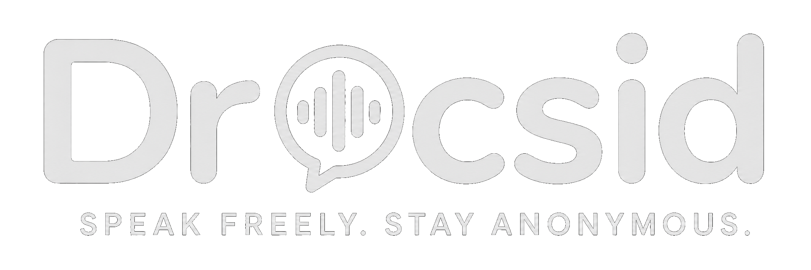

Drocsid is a self-hostable real-time communication platform for communities, teams, and private groups. It combines text chat, voice, video, screen sharing, permissions, notifications, and multi-platform clients on top of a stack built around React, Node.js, Supabase, Socket.io, and LiveKit.

The public documentation set is organized so the main README stays aligned with the infrastructure and service-specific installation guides (see below).

## Features

- Real-time messaging with Markdown, syntax highlighting, emojis, GIFs, and file sharing
- Voice channels, video calls, and screen sharing powered by LiveKit WebRTC
- Role hierarchy and granular permissions for channels and moderation
- Private channels and read-only channels
- Polls, notifications, themes, and personal notes
- Web client, Electron desktop app, and a separate React Native + Expo mobile app
- Self-hostable architecture with separate app, database/auth, and media services

## Tech stack

| Layer | Technology |
| --- | --- |
| Frontend web | React 19, Vite 6, Tailwind CSS 4, Zustand, Motion |
| Backend | Node.js, Express, Socket.io |
| Database and auth | Supabase (PostgreSQL, GoTrue, Realtime, Storage) |
| Voice/video | LiveKit |
| Desktop | Electron |
| Mobile | React Native + Expo |
| Notifications | Web push and Expo-based mobile push |

## Documentation map

- `README.md` → project overview and main setup path
- `INFRASTRUCTURE_OVERVIEW.md` → architecture, domains, ports, and request flow
- `SUPABASE_SELF_HOSTED.md` → self-hosted Supabase, Kong, auth, Google OAuth
- `LIVEKIT_SELF_HOSTED.md` → LiveKit, TURN, token endpoint, firewall rules
- `.env.example` → environment variable template for the web/backend deployment

## Keyboard shortcuts

- `Ctrl + K` or `Cmd + K` → global search
- `Arrow Up` → edit the last sent message when the input is empty
- `Esc` → cancel the current action or close open UI layers
- `Arrow Left / Arrow Right` → navigate images in the media gallery

## Internationalization

Drocsid uses `i18next` and currently supports:

- English
- French
- Spanish

## Self-hosting overview

The recommended production deployment uses three public domains routed through Nginx:

- `https://drocsid.yourdomain.com` → Drocsid web app and backend
- `https://supabase.yourdomain.com` → Supabase public API entrypoint
- `https://livekit.yourdomain.com` → LiveKit HTTPS API, WSS signaling, and token endpoint

Recommended local upstreams on the host:

- `127.0.0.1:3000` → Drocsid app/backend
- `127.0.0.1:8000` → Supabase Kong gateway
- `127.0.0.1:7880` → LiveKit signaling/API
- `127.0.0.1:3001` → dedicated LiveKit token endpoint service

Reference choices used throughout the docs:

- Kong stays on local port `8000`
- Nginx + Certbot are the recommended public entrypoint
- LiveKit built-in TURN is the recommended TURN path
- the public token endpoint is `https://livekit.yourdomain.com/api/livekit/token`

## Prerequisites

Before installing Drocsid, prepare:

- Node.js 18 or newer
- npm
- Docker and Docker Compose
- Nginx
- Certbot
- a VPS or Linux server with public DNS records
- a real domain name with at least three subdomains

For production use, HTTPS is strongly recommended across the public stack because auth redirects, browser mic/camera access, secure cookies, and WebRTC signaling all behave more reliably in a secure context.

## Supabase setup

Drocsid uses Supabase for PostgreSQL storage, authentication, realtime features, and storage buckets.

Recommended setup path:

1. Deploy Supabase from the official self-hosted Docker stack
2. Put Nginx in front of it and proxy the public Supabase domain to Kong on `127.0.0.1:8000`
3. Load the Drocsid SQL schema
4. Create the storage buckets expected by the app
5. Configure Google OAuth correctly

Important auth rule:

- `GOTRUE_SITE_URL` must point to the Drocsid app URL, not the Supabase domain

Example public split:

- `https://supabase.yourdomain.com/auth/v1/callback` → Google OAuth callback handled by Supabase
- `https://drocsid.yourdomain.com` → final app destination after auth flow

Typical storage buckets used by Drocsid:

- `avatars`
- `attachments`
- `server-icons`
- `emojis` if your build includes custom emoji storage

See `SUPABASE_SELF_HOSTED.md` for the detailed installation guide.

## LiveKit setup

Drocsid uses LiveKit for voice, video, and screen sharing.

Reference deployment model:

- LiveKit signaling/API behind Nginx
- public endpoint on `https://livekit.yourdomain.com`
- client WSS endpoint on `wss://livekit.yourdomain.com`
- public token endpoint on `https://livekit.yourdomain.com/api/livekit/token`
- local token service on `127.0.0.1:3001`
- built-in TURN enabled in LiveKit

Required host and cloud firewall ports:

- `80/tcp`
- `443/tcp`
- `3478/tcp`
- `3478/udp`
- `50000-60000/udp`

Without the TURN and UDP media ports, users may be able to join a room but still fail to transmit audio or video.

See `LIVEKIT_SELF_HOSTED.md` for the detailed installation guide.

## Application setup

Clone the repository and install dependencies:

```bash
git clone https://github.com/dr0csid/drocsid.git
cd drocsid
npm install
```

Create your environment file:

```bash
cp .env.example .env
```

Example variables for the web/backend deployment:

```env
APP_URL=https://drocsid.yourdomain.com
VITE_BACKEND_URL=https://drocsid.yourdomain.com

VITE_SUPABASE_URL=https://supabase.yourdomain.com
VITE_SUPABASE_PUBLISHABLE_KEY=your_supabase_publishable_key
SUPABASE_SERVICE_ROLE_KEY=your_supabase_service_role_key

LIVEKIT_API_KEY=your_livekit_api_key
LIVEKIT_API_SECRET=your_livekit_api_secret

VITE_LIVEKIT_URL=wss://livekit.yourdomain.com
VITE_LIVEKIT_TOKEN_ENDPOINT=https://livekit.yourdomain.com/api/livekit/token

VITE_SUPERADMIN_EMAIL=your_email@domain.com
```

Notes:

- `VITE_SUPABASE_URL` must use the public HTTPS Supabase domain, not an internal container address
- `SUPABASE_SERVICE_ROLE_KEY` must remain server-side only
- `LIVEKIT_API_KEY` and `LIVEKIT_API_SECRET` must match the values configured in LiveKit
- the token endpoint path should stay consistent with the reverse proxy and LiveKit documentation

## Development

Run the web/backend app locally with:

```bash
npm run dev
```

Typical local values:

```env
VITE_BACKEND_URL=http://localhost:3000
VITE_SUPABASE_URL=http://localhost:8000
```

If you test Google auth locally, make sure the local app URL is allowed in both Supabase auth configuration and your Google OAuth client settings.

## Production

Build and start the web/backend app:

```bash
npm run build
npm start
```

In production, the app is typically exposed behind Nginx, which proxies the public Drocsid domain to the local Node process.

## Desktop and mobile

Drocsid’s public-facing documentation should distinguish clearly between the three client surfaces:

- Web → the main self-hosted deployment covered by this README
- Desktop → Electron app built from the Drocsid codebase
- Mobile → separate React Native + Expo project

That means this repository’s infrastructure docs describe the shared backend services used by all clients, but the mobile app has its own project, build pipeline, and release process.

## Mobile push notifications

Drocsid mobile uses React Native with Expo and relies on the Expo Push Service for smartphone push notifications. The mobile app is the device-side recipient, Expo is the relay layer, Apple APNs and Google FCM are the operating-system delivery providers, and the Drocsid backend decides when a notification should be sent.

### Push architecture

The end-to-end push flow involves four actors:

- The smartphone app, which requests notification permission from the user
- Apple APNs or Google FCM, which are the only services allowed to wake a device and display a push notification
- Expo Push Service, which acts as the unified relay between your app ecosystem and the platform-specific push providers
- The Drocsid backend and Supabase database, which store device tokens and trigger notifications when application events occur

### Android and Firebase Console

Android push notifications require a Firebase project because Expo ultimately relays Android notifications through Firebase Cloud Messaging. For Drocsid, the Android package name should match the mobile app package, for example `com.drocsid.app`.

What to configure in Firebase Console:

1. Create a Firebase project.
2. Add an Android application to that project using the exact package name used by the mobile app.
3. Download the `google-services.json` file.
4. Place that file in the Expo mobile project and reference it from the Android config, typically through `app.json` or the project’s Expo configuration.
5. Retrieve the Firebase Cloud Messaging Server Key if your Expo workflow requires it for Android push delivery.

### Expo configuration

Expo must be configured so it can generate and register push tokens correctly. The mobile app should:

- request notification permission from the user
- initialize push notification support with the correct Expo configuration
- include the Android Firebase config through `google-services.json`
- generate an `ExpoPushToken` for the device
- send that token to the backend or to Supabase for storage

For Android, the Expo mobile project must be aligned with the Firebase configuration so Expo can hand notifications off to FCM correctly. For iOS, Expo relays through APNs, so the corresponding Apple push configuration must also be valid in the mobile project.

### Token lifecycle

The mobile push flow works like this:

1. The user opens the React Native app.
2. The app requests push notification permission from the operating system.
3. The app obtains a device-specific push identity through the native platform flow and Expo returns an `ExpoPushToken`.
4. The mobile app sends that token to your backend or directly to Supabase.
5. The token is stored in the `expo_push_tokens` table and linked to the authenticated user.
6. When an event occurs, such as a direct message or mention, the backend loads the recipient’s Expo push tokens from Supabase.
7. The backend sends the notification payload to `https://exp.host/--/api/v2/push/send`.
8. Expo relays the notification to APNs or FCM, which deliver it to the device.

### Troubleshooting focus

If mobile push notifications do not work, check these points first:

- the user granted notification permission on the device
- the app successfully generated an `ExpoPushToken` (could be checked in the supabase DB - expo_push_tokens table)
- the backend can reach the Expo Push API over the public internet
- the mobile project’s Android and iOS push configuration is valid

## Windows stream audio support

Drocsid includes two native Windows helper executables in the `/bin` directory to improve application streaming from the Windows desktop app.

These helpers are used only on Windows and are specifically intended to make application sharing behave better when a user streams a selected app window from the Electron desktop client.

### Included binaries

- `WindowsPIDResolver.exe` identifies and returns the exact PID of the application selected in the Drocsid screen sharing UI on Windows.
- `ApplicationLoopback.exe` receives that PID, captures the audio output of the target process, and forwards it into the stream pipeline.

### How it works

When a Windows user shares a specific application, Drocsid resolves the real process ID of the selected target and passes it to the audio loopback helper.

The loopback helper then captures the audio of that target application and injects it into the stream sent through LiveKit. This makes the stream include the sound of the shared application instead of being limited to video only.

### Result for viewers

When the streamer uses the Windows desktop app, viewers on any supported platform can watch the stream with audio, including:

- Windows
- Linux
- macOS
- Web browser
- Mobile clients

### Important limitation

Application audio streaming through these helpers is currently available only when the person sharing the stream uses the Windows desktop app.

If the streamer uses another platform, viewers may still receive the video stream, but the stream can remain silent because the Windows-specific process audio capture path is not available.

## Super admin model

Drocsid includes a super admin concept that depends on both backend/database logic and frontend expectations.

Recommended alignment:

- the email embedded in your SQL bootstrap logic should be your real admin email
- `VITE_SUPERADMIN_EMAIL` should match that same email
- if those values differ, the database and UI may disagree about who should be treated as a super admin

If needed, you can repair a user profile manually with SQL after first login.

## Multi-instance model

Drocsid is designed with a multi-instance mindset.

A client can be configured to point to different Drocsid-compatible backends over time, as long as the expected backend services and schema are present. Each instance keeps its own users, communities, and history.

## Troubleshooting

### Google auth redirects to the wrong place or fails

Symptoms:

- Google login ends on a blank page
- Google reports an invalid redirect URI
- the flow returns to the wrong domain
- the user lands on the Supabase host instead of inside Drocsid

Checks:

1. Verify that `GOTRUE_SITE_URL` points to the Drocsid app URL.
2. Verify that the Google OAuth callback is the public Supabase callback URL:
   - `https://supabase.yourdomain.com/auth/v1/callback`
3. Verify that `GOTRUE_URI_ALLOW_LIST` includes all expected web, desktop, and local development URLs.
4. Verify that the Google Cloud OAuth client contains the exact authorized redirect URI.
5. Restart the Supabase stack after changing auth-related environment variables.

Common mistake:

- setting `GOTRUE_SITE_URL` to the Supabase domain instead of the Drocsid app URL

### Super admin UI does not appear

Symptoms:

- login works
- the account exists
- but the expected super admin UI is missing

Checks:

1. Verify that `VITE_SUPERADMIN_EMAIL` matches your real admin email exactly.
2. Verify that your SQL bootstrap or manual SQL update marked the correct profile as super admin.
3. Log out and log back in after changing admin-related data.
4. Check the user row in `public.profiles` if your schema stores admin flags there.

Example repair query:

```sql
UPDATE public.profiles
SET is_super_admin = true,
    can_create_servers = true,
    max_servers = 100
WHERE email = 'your_actual_email@domain.com';
```

### Voice or video does not work

Symptoms:

- joining a room fails
- the UI stays on `Connecting...`
- the token request fails
- connection succeeds but no audio/video passes

Checks:

1. Verify `VITE_LIVEKIT_URL` uses `wss://livekit.yourdomain.com`.
2. Verify the public token endpoint is `https://livekit.yourdomain.com/api/livekit/token`.
3. Verify the token service is running on `127.0.0.1:3001` and reachable through Nginx.
4. Verify `LIVEKIT_API_KEY` and `LIVEKIT_API_SECRET` match the values configured in LiveKit.
5. Verify ports `3478/tcp`, `3478/udp`, and `50000-60000/udp` are open on both the host firewall and the cloud firewall.
6. Check browser console logs, token service logs, and LiveKit logs.

Important distinction:

- if token generation fails, the problem is usually backend config or reverse proxying
- if signaling works but no audio/video passes, the problem is usually TURN, NAT traversal, or blocked UDP ports

### Windows stream has video but no application audio

Symptoms:

- a Windows desktop user can start a stream
- viewers receive the video correctly
- but the streamed application sound is missing

Checks:

1. Verify the stream is being started from the Windows desktop app, not from another platform.
2. Verify the helper executables are present in the `/bin` directory:
   - `WindowsPIDResolver.exe`
   - `ApplicationLoopback.exe`
3. Verify the selected target is an application window and not a capture mode that bypasses the process-based audio path.
4. Check the desktop app logs or process launch behavior to confirm both helper executables are being invoked correctly.
5. If viewers are on other platforms, remember that playback support is cross-platform, but the audio capture path itself depends on the Windows streamer.

### Uploads fail for avatars, attachments, or server icons

Symptoms:

- upload requests fail
- storage returns bucket not found
- storage returns 403 or permission errors

Checks:

1. Verify the required storage buckets exist.
2. Verify their names exactly match what the app expects.
3. Verify bucket visibility and storage policies match your schema logic.
4. Verify your SQL and storage policy bootstrap completed successfully.
5. Verify `VITE_SUPABASE_URL` points to the correct public Supabase endpoint.

Typical buckets:

- `avatars`
- `attachments`
- `server-icons`
- `emojis` if enabled in your build

### The app is stuck on “Connecting to server...”

Symptoms:

- the frontend loads
- the app does not fully initialize
- Socket.io or API requests fail repeatedly

Checks:

1. Verify the Drocsid backend process is running.
2. Verify Nginx proxies the public app domain to the local backend correctly.
3. Verify `VITE_BACKEND_URL` matches the expected public backend URL.
4. Check browser network requests and console errors.
5. Check server logs for crashes, CORS issues, or rejected hosts.

### Push notifications are not delivered

Symptoms:

- users do not receive push notifications
- Expo device tokens or web push subscriptions are missing
- notifications fail server-side

Checks:

1. Verify users granted notification permission on the device or browser.
2. Verify the relevant Expo device token or web push subscription is stored correctly.
3. Verify the backend has outbound internet access if a relay service is used.
4. Verify your push-related environment variables are configured on the server.
5. Check backend logs when a notification should have been sent.

### Supabase works partly but realtime seems broken

Symptoms:

- data is inserted correctly
- refresh shows the new state
- but live updates do not appear immediately

Checks:

1. Verify the realtime service is healthy in the Supabase stack.
2. Verify the relevant tables are included in realtime publication if your schema requires that setup.
3. Check browser console and websocket/network logs.
4. Verify the public Supabase endpoint is the one used by the client.

Legal:
Use, modification, and redistribution of Drocsid are allowed. A mention of Drocsid in any derivative project would be appreciated.

Enjoy
